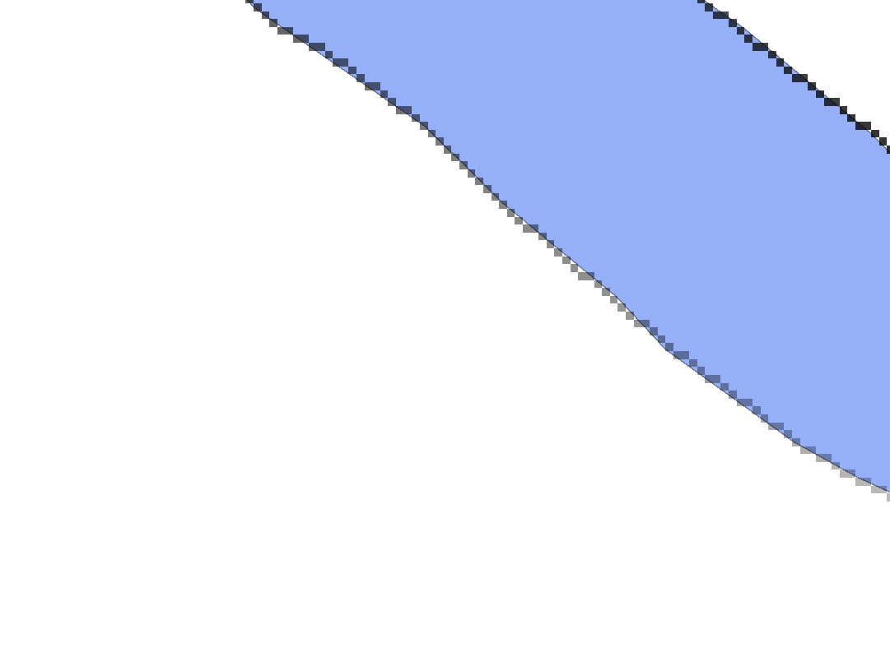

# 1.2.1. Підготовка растру водних об'єктів `#water_px_id_raster`

- Наявні лінійні об'єкти переводимо в полігональні таким чином, щоб в результаті протилежні сторони контуру об'єкту були кодовані різними пікселями растру. Тобто, товщина об'єкту в растрі має бути виражена більш ніж одним пікселем.
- Це можна зробити через буфер із розміром, що помножений на 2 дає відстань, більшу від діагоналі пікселя на одну найменшу значущу цифру.
- Контур полігональних об'єктів переводимо у растр. Мета - отримати растрову інформацію про водні об'єкти, де кожен значимий піксель містить окремий ID пікселя. Нумерація ID має починатись із 1.

## Для розрахунку використано практичні алгоритми

1. **Generate points (pixel centroids) along line**, який генерує точковий векторний шар з вхідного растра та лінійного шару водних об'єктів.  
   Посилання на опис алгоритму: https://docs.qgis.org/3.40/en/docs/user_manual/processing_algs/qgis/vectorcreation.html#qgisgeneratepointspixelcentroidsalongline
2. **Rasterize (vector to raster)**, який перетворює векторні геометрії (точки, лінії та полігони) на растрове зображення. Заснований на утиліті `gdal_rasterize` бібліотеки GDAL.  
   Посилання на опис алгоритму: https://docs.qgis.org/3.40/en/docs/user_manual/processing_algs/qgis/vectorcreation.html#qgisgeneratepointspixelcentroidsalongline

## a) Generate points (pixel centroids) along line

Використовуємо алгоритм **Generate points (pixel centroids) along line**, з прив'язкою до DEM із екстентом і розміром пікселя з DEM. В результаті отримуємо векторний шар центроїдів пікселів для водних об'єктів `#water_px_id_vector`.

Можливі налаштування:

```yaml
{
  "area_units": "m2",
  "distance_units": "meters",
  "ellipsoid": "EPSG:7024",
  "inputs": {
    "INPUT_RASTER": "../dem.tif",
    "INPUT_VECTOR": "../bodies.gpkg|layername=bodies",
    "OUTPUT": "TEMPORARY_OUTPUT"
  }
}
```


> Отриманий результат - точковий шар центроїдів з атрибутом ID, пронумерованим починаючи з 1.

*Отриманий результат зберігаємо в постійній пам'яті.*

## b) Rasterize (vector to raster)

Після цього, для отриманого шару точок використовуємо алгоритм **Rasterize (Vector to raster)**, із зазначенням ID векторної точки `#water_px_id_vector` як значимого атрибуту.

Можливі налаштування:

```yaml
{
  "area_units": "m2",
  "distance_units": "meters",
  "ellipsoid": "EPSG:7024",
  "inputs": {
    "BURN": 0.0,
    "DATA_TYPE": 0,
    "EXTENT": null,
    "EXTRA": "",
    "FIELD": "id",
    "HEIGHT": 1.0,
    "INIT": null,
    "INPUT": "TEMPORARY_OUTPUT",
    "INVERT": false,
    "NODATA": 0.0,
    "OPTIONS": "COMPRESS=NONE|BIGTIFF=IF_NEEDED",
    "OUTPUT": "../#water_px_id_raster.tif",
    "UNITS": 1,
    "USE_Z": false,
    "WIDTH": 1.0
  }
}
```



> **Результат** - одноканальний растр водних об'єктів `#water_px_id_raster`, зберігаємо в постійну пам'ять комп'ютера.
