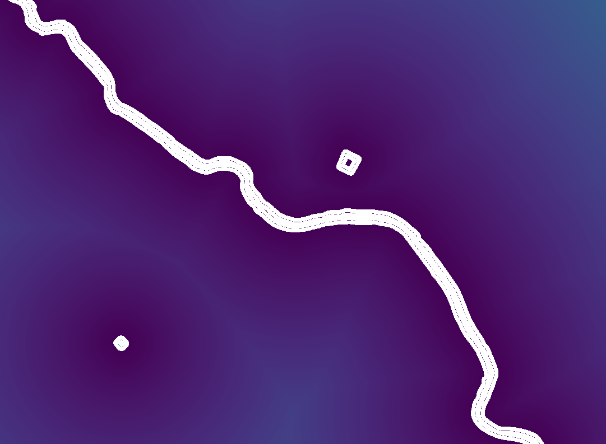
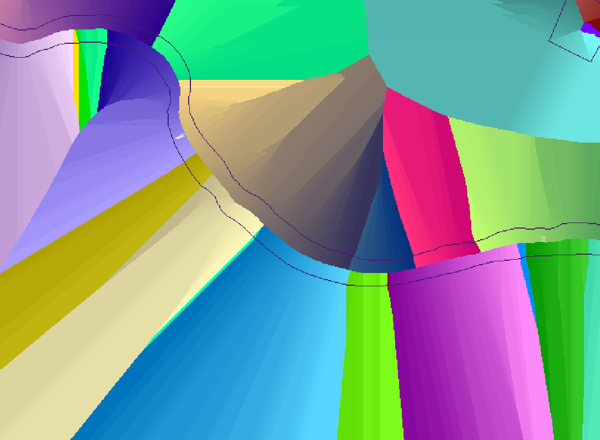

# 1.2.3. Підготовка растрів віддаленості та найближчого пікселя водного об'єкту

Підготовка **растрів віддаленості від** найближчого пікселя **водного об'єкту** `#distance_raster` та **відстані пікселя до найближчого** пікселя **водного об'єкту** `#nearest_water_pix_id_raster`.

> Для розрахунку використано практичний алгоритм **r.grow.distance**, що генерує растри відстаней до найближчих цільових растрових об'єктів та значення найближчого цільового пікселя.  
> Посилання на опис алгоритму: https://grass.osgeo.org/grass-stable/manuals/r.grow.distance.html

Вхідними даними для розрахунку є растр `#water_px_id_raster`.

Приклад налаштувань алгоритму:

```yaml
{
  "area_units": "m2",
  "distance_units": "meters",
  "ellipsoid": "EPSG:7024",
  "inputs": {
    "-m": false,
    "-n": false,
    "GRASS_RASTER_FORMAT_META": "",
    "GRASS_RASTER_FORMAT_OPT": "",
    "GRASS_REGION_CELLSIZE_PARAMETER": 0.0,
    "GRASS_REGION_PARAMETER": "numerical #dem extent [EPSG:given EPSG]",
    "distance": "../#distance_raster.tif",
    "input": "../#water_px_id_raster.tif",
    "metric": 0,
    "value": "../#nearest_water_pix_elev_id.tif"
  }
}
```




> **Результат** - одноканальні растри значення відстані пікселя до найближчого пікселя водного об'єкту `#distance_raster` та значення ідентифікатора найближчого пікселя водного об'єкту `#nearest_water_pix_id_raster`, зберігаємо в постійну пам'ять комп'ютера.
