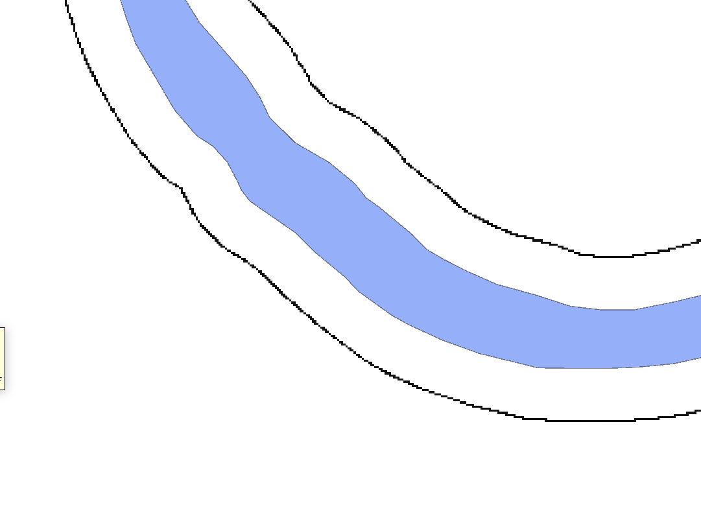

# 2.1. Для визначення величини кута нахилу рельєфу потрібні наступні растрові дані та операції

## 1. `#dem_in_buffer_25_raster`

Растр значень висоти рельєфу на відстані 25 метрів від найближчого пікселя водного об'єкту, де значимі пікселі містять значення висоти, а незначимі - *NAN*.

Отримується через:

```yaml
(#distance_raster >= 25 and #distance_raster < 26) * #dem
```


> Діапазон `><` залежить від розміру пікселя растру. Якщо піксель = 1 м, то діапазон вибору = 1 метр, якщо розмір пікселя інший, то відповідно змінюємо діапазон.

## 2. `#nearest_water_pix_elev_raster_in_buffer_25`

Растр значень висоти водного об'єкту в найближчому пікселі водного об'єкту, в буфері 25 метрів від водного об'єкту, де значимі пікселі містять значення висоти, а незначимі - *NAN*.

Отримується через:

```yaml
(#dem_in_buffer_25_raster > 0) * #nearest_water_pix_elev_raster
```



## 3. `#distance_in_buffer_25_raster`

Растр значень відстаней від найближчого пікселя водного об'єкту, в буфері 25 метрів від водного об'єкту, де значимі пікселі містять значення відстані, а незначимі - *NAN*.

Отримується через:

```yaml
(#dem_in_buffer_25_raster > 0) * #distance_raster
або
(#nearest_water_pix_elev_raster_in_buffer_25 > 0) * #distance_raster
```
