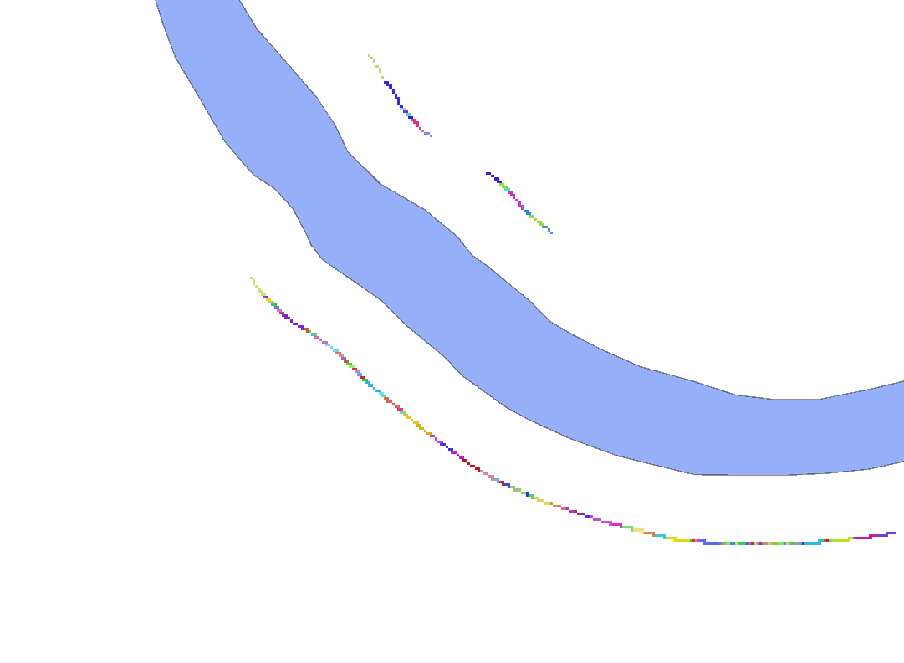

# 2.3. Ідентифікація пікселів водних об'єктів, найближчих до точок буферу із понаднормативними кутами

Наступним кроком необхідно ідентифікувати пікселі водних об'єктів, найближчі до точок буферу із понаднормативними кутами, та створити відповідний растр `#slope_detected_water_pix_id_raster_in_buffer_25`.

```yaml
(#slope_detected_in_buffer_25 > 0) * #nearest_water_pix_id_raster
```



```yaml
Зазначені вище в частині 2 кроки можна спростити і одразу отримати растр за допомогою виразу:
IF((((#distance_raster >= 25 and #distance_raster < 26)* #dem - ((#distance_raster >= 25 and #distance_raster < 26)* #dem > 0)* #nearest_water_pix_elev_raster)/(#distance_raster >= 25 and #distance_raster < 26)) > 0.05240778, 1, 0 )*#nearest_water_pix_id_raster

або ж в QGIS:
(IF(((("distance_raster@1" >= 25 and "distance_raster@1"< 26)*"dem_1_m@1" - (("distance_raster@1" >= 25 and "distance_raster@1"< 26)* "dem_1_m@1" > 0)*"nearest_water_pix_elev_raster@1")/("distance_raster@1" >= 25 and "distance_raster@1"< 26)) > 0.05240778, 1, 0 ))*"nearest_water_pix_id_raster@1"
```
