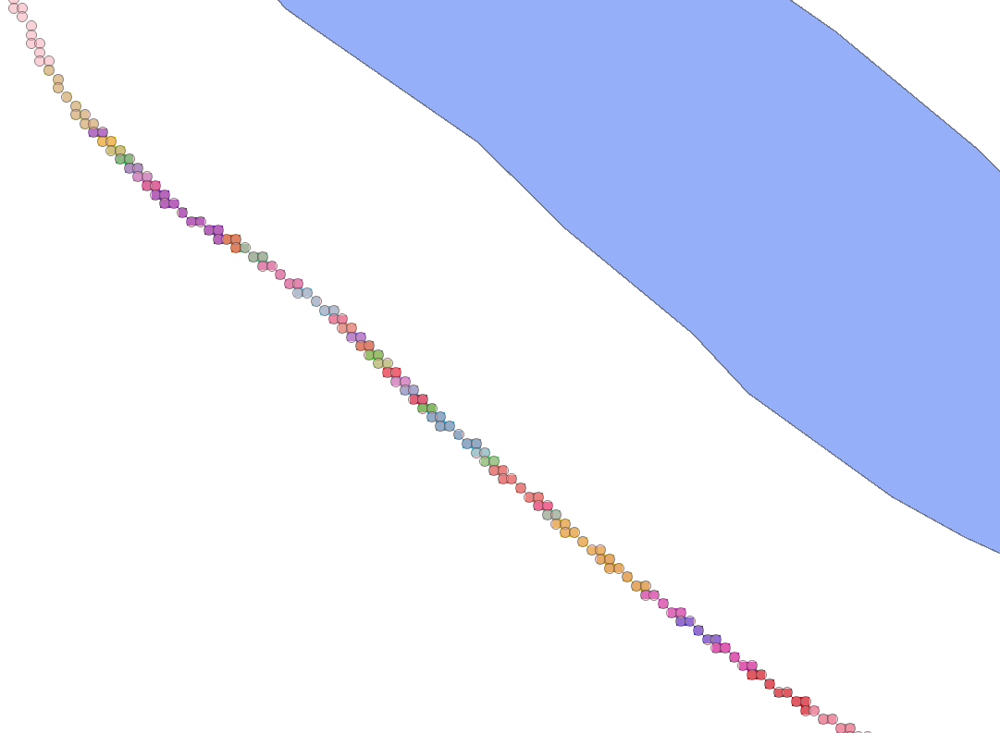

# 2.4. Отримання таблиці `#slope_detected_table`

З растру `#slope_detected_water_pix_id_raster_in_buffer_25` за допомогою алгоритму **Raster layer unique values report** отримуємо список ідентифікаторів пікселів водних об'єктів, найближчих до точок буферу із понаднормативними кутами - табличку `#slope_detected_table`.

Отриману табличку доцільно зберегти у постійний файл (наприклад GeoPackage).

Можливі налаштування:

```yaml
{
  "area_units": "m2",
  "distance_units": "meters",
  "ellipsoid": "EPSG:7024",
  "inputs": {
    "BAND": 1,
    "INPUT": "../#slope_detected_water_pix_id_raster_in_buffer_25",
    "OUTPUT_TABLE": "../#slope_detected_table.gpkg"
  }
}
```



> Опис алгоритму **Raster layer unique values report** доступний за посиланням: https://docs.qgis.org/3.44/en/docs/user_manual/processing_algs/qgis/rasteranalysis.html#qgisrasterlayeruniquevaluesreport
