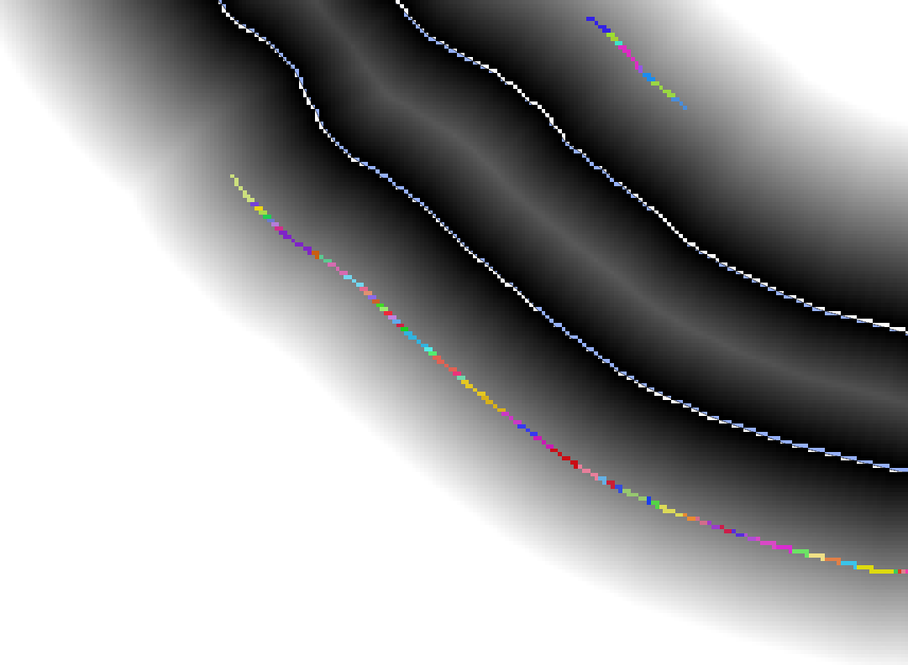

# 2.5. Підготовка `#nearest_water_pix_id_raster_in_50_m`

Паралельно з існуючого растрового шару значень ідентифікатора найближчого пікселя водного об'єкту виділяємо пікселі в максимальному нормативно визначеному буфері (наприклад 50 метрів, що є максимальним, подвоєним розміром ПЗС для малих річок) `#nearest_water_pix_id_raster_in_50_m`.

Цей растр буде основою для визначення зон ПЗС із максимальним розміром:

```yaml
(#distance_raster <= 50) * #nearest_water_pix_id_raster
```



На цьому етапі, для візуальної перевірки коректності розрахунку, растру `#nearest_water_pix_id_raster_in_50_m` доцільно присвоїти символіку `Paletted/Unique Values`.
