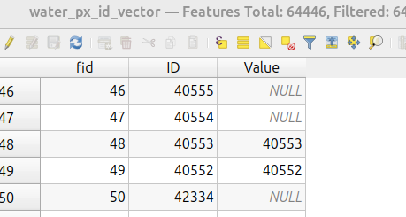

# 2.6. Join `#slope_detected_table` до `#water_px_id_vector`

Після пункту **2.4.** до існуючого векторного шару центроїдів пікселів водних об'єктів `#water_px_id_vector` приєднуємо (`Join`) за атрибутом `ID→Value` отриману табличку `#slope_detected_table`.

> Таким чином, ми отримуємо таблицю із діапазоном всіх ID пікселів водних об'єктів та атрибутом `Value`, який ідентифікує пікселі, де ухил є понаднормативним.

> **Увага!** Для подальших кроків приєднаний атрибут повинен мати тип даних `Integer`.
