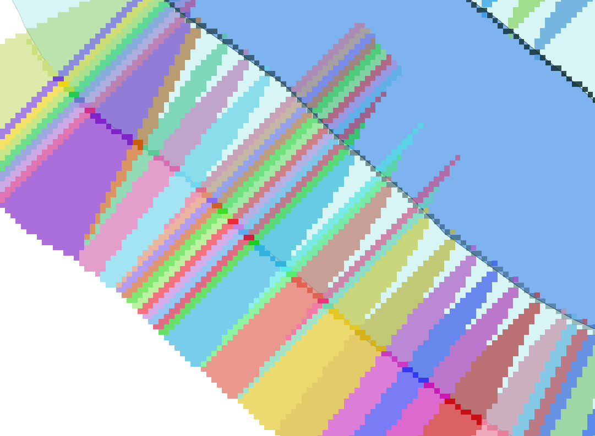

# 2.7. Reclassify by layer для `#nearest_water_pix_id_raster_in_50_m`

Отриманий векторний шар використовуємо як таблицю для рекласифікації растру `#nearest_water_pix_id_raster_in_50_m` алгоритмом **Reclassify by layer**.

*Увага - `max`, `min field` беруться із діапазону ID пікселів води, а не просто `FID` об'єкту в таблиці. `Value field` - це приєднані значення точок ухилів на стандартному буфері.*

Можливі налаштування:

```yaml
{
  "area_units": "m2",
  "distance_units": "meters",
  "ellipsoid": "EPSG:7024",
  "inputs": {
    "CREATE_OPTIONS": "COMPRESS=NONE|BIGTIFF=IF_NEEDED",
    "DATA_TYPE": 3,
    "INPUT_RASTER": "../#nearest_water_pix_id_raster_in_50_m",
    "INPUT_TABLE": "../#water_px_id_vector",
    "MAX_FIELD": "ID",
    "MIN_FIELD": "ID",
    "NODATA_FOR_MISSING": true,
    "NO_DATA": 0.0,
    "OUTPUT": "TEMPORARY_OUTPUT",
    "RANGE_BOUNDARIES": 2,
    "RASTER_BAND": 1,
    "VALUE_FIELD": "Value"
  }
}
```

> Суть алгоритму `Reclassify by table` полягає в тому, що з існуючого діапазону всіх пікселів водних об'єктів (атрибут `ID`) ми обираємо ті значення, які вказують на наявність ухилу (атрибут `Value`), а значення із діапазону всіх `ID`, що відсутні (`Null`) в атрибуті `Value`, класифікуються в растрі, як відсутні.

> *Важливо:* параметр `Output_value_field` має бути цілим числом, інакше **Reclassify by layer** видаватиме помилку.

Рекласифікований растр `#pz_raster_in_50_meter` ідентифікує території, де ПЗС водних об'єктів подвоєна через наявність понаднормативних ухилів між контуром водного об'єкту та стандартним нормативним ухилом.

На цьому етапі, для візуальної перевірки коректності розрахунку, растру `#nearest_water_pix_id_raster_in_50_m` доцільно перенести символіку `Paletted/Unique Values` з растру `#nearest_water_pix_id_raster_in_50_m` на растр `#pz_raster_in_50_meter`.



> Опис алгоритму **Reclassify by layer** доступний за посиланням: https://docs.qgis.org/3.40/en/docs/user_manual/processing_algs/qgis/rasteranalysis.html#qgisreclassifybylayer
