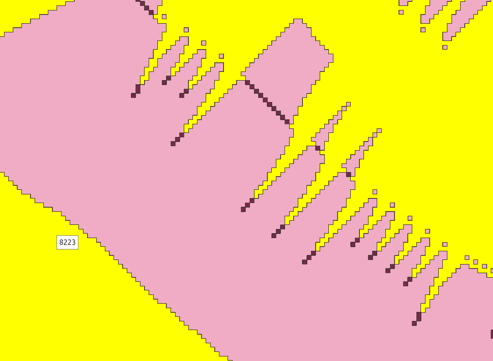

# 2.8.2. Polygonize (Raster to vector)

Векторизовуємо отриманий растр `#pz_raster_in_50_meter_binary` алгоритмом **Polygonize (Raster to vector)**.

```yaml
{
  "area_units": "m2",
  "distance_units": "meters",
  "ellipsoid": "EPSG:7024",
  "inputs": {
    "BAND": 1,
    "EIGHT_CONNECTEDNESS": false,
    "EXTRA": "",
    "FIELD": "DN",
    "INPUT": "../#pz_raster_in_50_meter_binary",
    "OUTPUT": "TEMPORARY_OUTPUT"
  }
}
```



> Опис алгоритму **Polygonize (Raster to vector)** знаходиться за посиланням: https://docs.qgis.org/3.40/en/docs/user_manual/processing_algs/gdal/rasterconversion.html#gdalpolygonize
