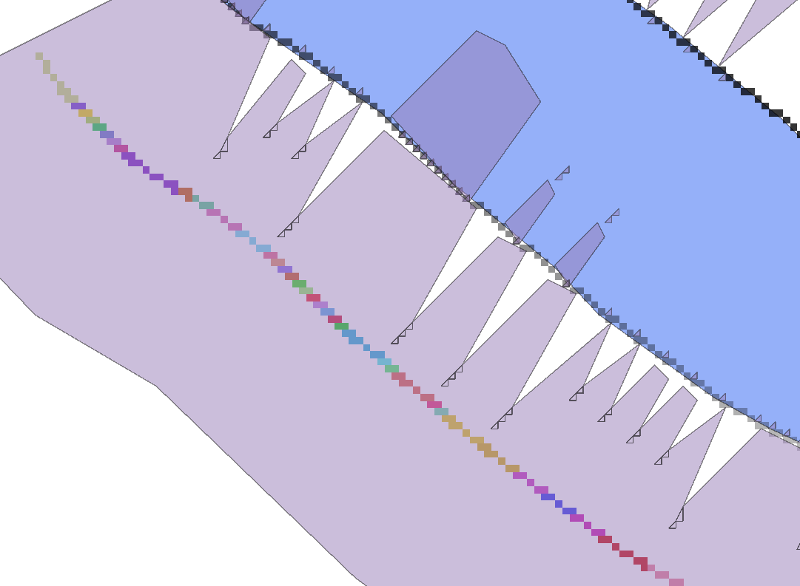

# 2.9. Simplify для `#polygonized`

В отриманому векторі `#polygonized` потрібно видалити об'єкт, який покриває значення `NAN`, і спростити його алгоритмом **Simplify**:

```yaml
{
  "area_units": "m2",
  "distance_units": "meters",
  "ellipsoid": "EPSG:7024",
  "inputs": {
    "INPUT": "../#polygonized",
    "METHOD": 0,
    "OUTPUT": "TEMPORARY_OUTPUT",
    "TOLERANCE": 1.415
  }
}
```

> Тут значення `"TOLERANCE": 1.415` вибрано, оскільки воно дорівнює розміру діагоналі пікселя в `1 м`, на якому тестовано датасети. Зазначення розміру діагоналі пікселя дозволяє коректно спростити геометрію отриманих векторних об'єктів.

> Опис алгоритму **Simplify** знаходиться за посиланням: https://docs.qgis.org/3.40/en/docs/user_manual/processing_algs/qgis/vectorgeometry.html#qgissimplifygeometries


