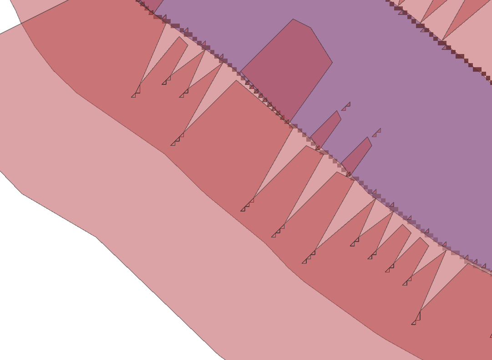
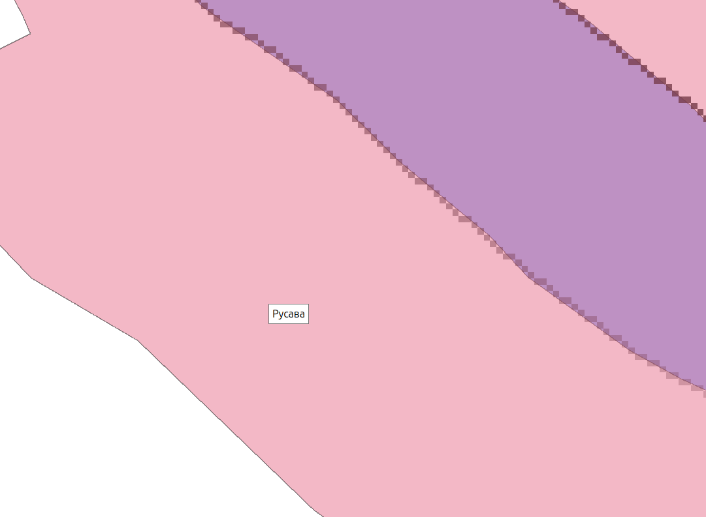

# 2.10. Merge і Dissolve з буфером стандартного розміру

Отриманий вектор `#simplified` ділянок ПЗС із подвійним розміром доцільно об'єднати із буфером ПЗС стандартного розміру `#buffered`, алгоритмами **Merge** і **Dissolve**.

```yaml
{
  "area_units": "m2",
  "distance_units": "meters",
  "ellipsoid": "EPSG:7024",
  "inputs": {
    "CRS": null,
    "LAYERS": [
      "memory:../#simplified"
      "memory:../#buffered"
    ],
    "OUTPUT": "TEMPORARY_OUTPUT"
  }
}
```



```yaml
{
  "area_units": "m2",
  "distance_units": "meters",
  "ellipsoid": "EPSG:7024",
  "inputs": {
    "FIELD": [],
    "INPUT": "memory:../merged"
    "OUTPUT": "TEMPORARY_OUTPUT",
    "SEPARATE_DISJOINT": false
  }
}
```



> Опис алгоритмів:
>
> **Merge**: https://docs.qgis.org/3.40/en/docs/user_manual/processing_algs/qgis/vectorgeneral.html#qgismergevectorlayers  
> **Dissolve**: https://docs.qgis.org/3.40/en/docs/user_manual/processing_algs/qgis/vectorgeometry.html#qgisdissolve
